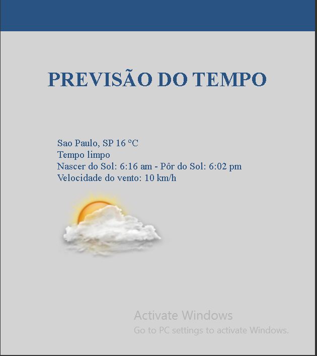

<h1 style="margin-bottom:50px">PREVISÃO DO TEMPO</h1>

Página que mostro como está o tempo na sua cidade.

Utiliza uma api para obter os dados.

<h4 align="center" style="margin-top:120px;"> 
	🚧  React Select 🚀 Em construção...  🚧
</h4>
